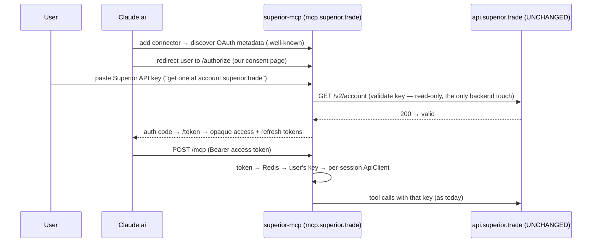

# Claude custom connector — build plan

**Status:** Plan / proposal — **no implementation yet.** This doc is the agreed design;
the code lands in follow-up PRs once the open decisions below are made.

**Hard constraint:** changes live **only in `superior-mcp`**. No changes to the product
backend (`api.superior.trade`) — no new endpoints, no OAuth on the backend, no schema.

---

## 1. Goal

Make Superior Trade installable in **Claude.ai → "Add custom connector."** That requires a
**remote MCP server** (Anthropic's cloud connects to a public URL) with **OAuth** so each user
acts as *their own* Superior account. The server already has a Streamable-HTTP transport
(`src/http.ts`, PR #2); this plan adds the OAuth layer and hosting around it.

> Local stdio (Claude Code / Desktop via `.mcp.json`) already works and is unchanged.

## 2. The idea that satisfies "no backend changes"

The MCP server becomes its **own OAuth 2.1 Authorization Server** (the MCP SDK ships the
scaffolding). The user's **login credential is their existing Superior API key**
(from `https://account.superior.trade`). The server validates it with the **read-only
`GET /v2/account`** endpoint that already exists, then mints **its own** token. Claude does
standard OAuth against the MCP server; the backend is only ever touched by that one read-only
validation call.

## 3. Design decisions locked by the security + protocol review

A skeptical security/protocol review (against the MCP 2025-06-18 auth spec, Claude's
connector docs, and the installed SDK) confirmed the architecture is sound and is essentially
the only option given the no-backend constraint. It also forced these non-negotiables:

| # | Decision | Why |
|---|---|---|
| 1 | **Opaque token + key encrypted-at-rest in Redis** (NOT a stateless JWT carrying the key) | A stateless token can't be revoked and would put a long-lived trading key on the wire — violates the MCP spec's token-passthrough prohibition. |
| 2 | **Refresh tokens with rotation** (`exchangeRefreshToken`) | Claude **requires** refresh tokens for public clients; without them sessions die and users re-paste keys constantly. |
| 3 | **Skip Dynamic Client Registration** — use **CIMD** or **`oauth_anthropic_creds`** | DCR is optional and discouraged — Claude registers a new client per connect → row sprawl. |
| 4 | **Pin the SDK to `1.27.x`** | `package.json` says `^1.12.1`, but the required/installed version is **1.27.1**; 1.12.1 predates the 2025 auth-spec rewrite and would break OAuth. |
| 5 | **Enforce audience binding** (validate token `resource` == `mcp.superior.trade`, RFC 8707) and **set `MCP_ALLOWED_HOSTS`** in prod | SDK surfaces the field but does not enforce it; DNS-rebind protection is off until the allowlist is set. |
| 6 | **Implement revocation** (`revokeToken` + `/revoke`; "disconnect in Claude" kills the token) | Opaque tokens are only as good as the ability to kill them. |

### What Claude requires (protocol checklist — SDK handles most)
- OAuth 2.1 + **PKCE S256** (mandatory). · **Protected Resource Metadata** RFC 9728 (401 + `WWW-Authenticate` → `/.well-known/oauth-protected-resource`). · **Authorization Server Metadata** RFC 8414 (`/.well-known/oauth-authorization-server`). · **Resource Indicators** RFC 8707 (audience binding). · HTTPS-only. The SDK's `mcpAuthRouter` + `requireBearerAuth` emit/enforce most of this; items 5–6 above are the parts we must add.

## 4. Security posture — the part to get right

The `/authorize` page collects users' **full-scope** Superior keys, and the server becomes a
**custodian of many users' trading keys**. This is a materially higher posture than the product
has today. Required handling:
- **Encrypt keys at rest** (envelope encryption; encryption key in the host secret manager, not the image).
- **Harden the consent page** as a security surface: HTTPS on the memorable apex (`mcp.superior.trade`), strict CSP, no third-party scripts, an origin banner, **link out** to `account.superior.trade` to obtain the key, and **never log/echo** the key.
- **Cache `/v2/account` validation** (short Redis TTL) so token refresh doesn't hammer the backend rate limit.
- **Incident plan:** Redis compromise ⇒ keys must be rotated; lacking a backend bulk-revoke, that means notifying users — a real limitation to accept knowingly.
- **Scope caveat:** a Superior key is full-scope (read **and** deploy), so consent grants everything. Within the MCP-only constraint we ship with a clear disclaimer. The single biggest risk-reducer — a **connector-scoped, revocable key** minted by the account portal — is **product work outside this constraint**; noted as a future lever, not a blocker.

## 5. Phased build (each phase = its own PR)

- **Phase 0 — Hygiene.** Pin SDK to `1.27.x`; re-verify metadata endpoints emit RFC 8414 + 9728.
- **Phase 1 — OAuth server (the bulk).** Custom `OAuthServerProvider`: metadata, `/authorize` (paste-key consent page) → validate via `GET /v2/account` → issue code; `/token` + refresh-token rotation; `/revoke`. Opaque tokens; **encrypted key in Redis**; audience binding. Protect `/mcp` with `requireBearerAuth` → resolve token→key → the per-session `ApiClient` (already built).
- **Phase 2 — Hosting.** Deploy at `mcp.superior.trade` on a long-running container (Fly/Render/Railway — **not** serverless: streamable-HTTP sessions + SSE are stateful). Env: encryption key, `REDIS_URL`, `MCP_ALLOWED_HOSTS`, public base URL. Single instance for MVP (in-memory transports + Redis tokens); sticky sessions / shared session store only when scaling past one instance.
- **Phase 3 — Polymarket v3 tools.** Add `src/tools/polymarket.ts` so the MCP distribution finally covers Polymarket (currently absent — `src/server.ts` registers only health/backtest/deployment). Additive, no auth interaction.
- **Phase 4 — Hardening + ship.** Rate limiting (`express-rate-limit`), no-key-logging audit, alerting on `/v2/account` 401 spikes (credential-stuffing signal), end-to-end test via Claude's "Add custom connector."

## 6. Open decisions (defaults in **bold**)
1. **Token store:** **Redis (Upstash)** — Option B. *(Stateless JWT ruled out by the review.)*
2. **Host:** `mcp.superior.trade` on **Fly / Render / Railway** (not serverless).
3. **Client registration:** **`oauth_anthropic_creds`** (lowest-friction MVP) vs CIMD (no shared secret).
4. **Token lifetime:** **1h access / 30d rotating refresh.**
5. **Polymarket tools:** **separate PR** (Phase 3) vs bundled.
6. *(Out-of-constraint, optional)* connector-scoped revocable key in the account portal — biggest risk-reducer; decide later.

## 7. What stays untouched
`api.superior.trade` and all backend code. The MCP server only makes the read-only `/v2/account`
validation call plus the normal per-user API calls it already makes. The stdio path is unchanged.

## 8. References
- MCP authorization spec (2025-06-18): https://modelcontextprotocol.io/specification/2025-06-18/basic/authorization
- Claude — building custom connectors / authentication: https://claude.com/docs/connectors/building/authentication
- Get started with custom connectors (remote MCP): https://support.claude.com/en/articles/11175166-get-started-with-custom-connectors-using-remote-mcp
- RFCs: 9728 (Protected Resource Metadata), 8414 (AS Metadata), 8707 (Resource Indicators), 7591 (DCR), OAuth 2.1 + PKCE.
- SDK OAuth scaffolding: `@modelcontextprotocol/sdk` `server/auth/` (`mcpAuthRouter`, `OAuthServerProvider`, handlers, `requireBearerAuth`).

> Plan only — no implementation in this PR. Phase 1 starts once the Section 6 decisions are made.
